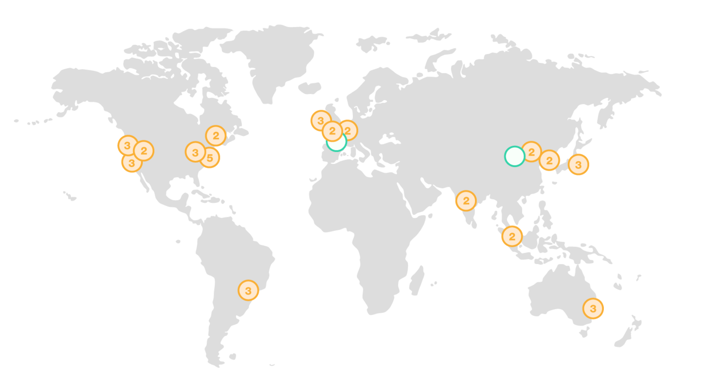

AWS 在全球建立许多数据中心，目前它们分布在全球 16 个 Region 中的 42 个 Availability Zone 里.

### 数据中心
数据中心是云服务底层的物质基础。
随着 AWS 规模越来越大，在全球建立了许多数据中心。那么如何来组织和设计这些数据中心，能让用户获得高可用的 AWS 云服务，又能满足用户在法规遵循方面的需求是非常重要的。
AWS 巧妙地采用了 Region 和 AZ 两层设计架构，而不是直接使用数据中心，把云服务与底层物理数据中心进行了解耦设计。

### Region (区域)
Region 指的是全球范围内的某个物理节点，它是这个地区的基础设施服务的集合。每个 Region 由多个 Availability Zone 组成。
这种使得云服务在地理上能更加靠近不同地区的用户，也使得用户可以选择在不同的区域存储数据以满足法规遵循的要求。
Region 之间是相互独立的，用户在不同区域存储的数据也是相互独立的，但是他们的独立程度与区域类型有关。目前，有 3 种类型：
 * GovCloud 区域：与其他区域独立的，主要是服务于美国的政府机构和部分美国客户。使用这种区域需要专门的申请和审核流程。
 * 中国区域：与其他区域独立的，专门服务于中国客户的区域。需要通过Amazon中国的网站来申请。
 * 除了上述两种以外的：面向所有用户，且共享同一个账户体系，以及共享部分 AWS 云服务，如控制管理台，Route53 等。
  如果一个用户想要使用这种区域和中国区域，则需要申请两个账户。

### Availability Zone (可用区)
Availability Zone 简称 "AZ"，由一个或者多个分散的数据中心组成。
每个都拥有独立的配套设施，其中包括冗余电源、联网和连接。这样如果一个 AZ 出了问题，不会影响l另外的 AZ。
在同一个 Region 内，AZ 与 AZ 之间，是通过高速网络连接的，从而保证低延迟。
 
### 问题
一个用户选择的 us-east-1a 与另一个用户选择的 us-east-1a 一定是同一个 AZ 吗？
 
---
 
*参考*
*https://aws.amazon.com/cn/about-aws/global-infrastructure/?nc2=h_l2_cc*
*https://aws.amazon.com/cn/about-aws/global-infrastructure/regional-product-services/*
*http://blog.csdn.net/awschina/article/details/17639191*