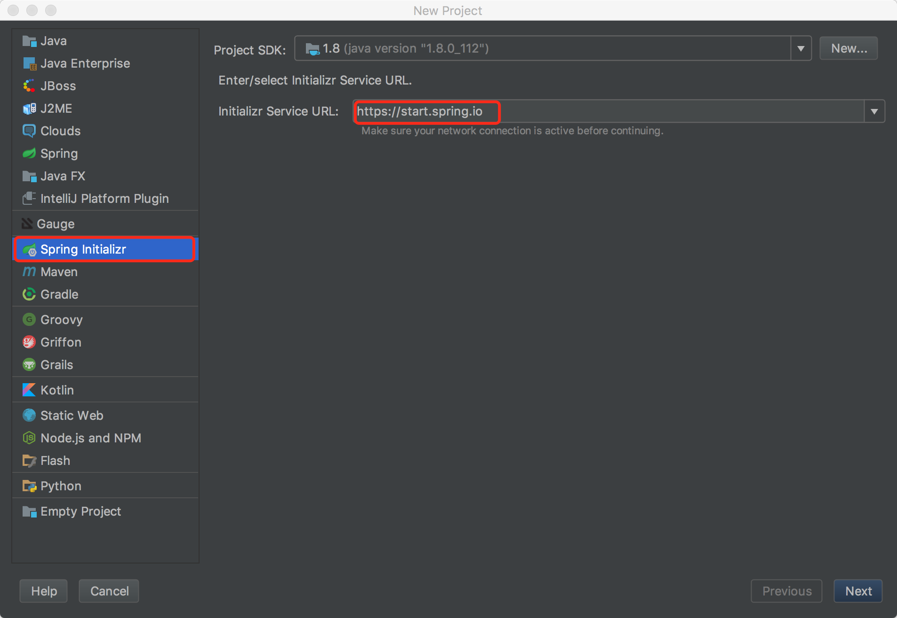
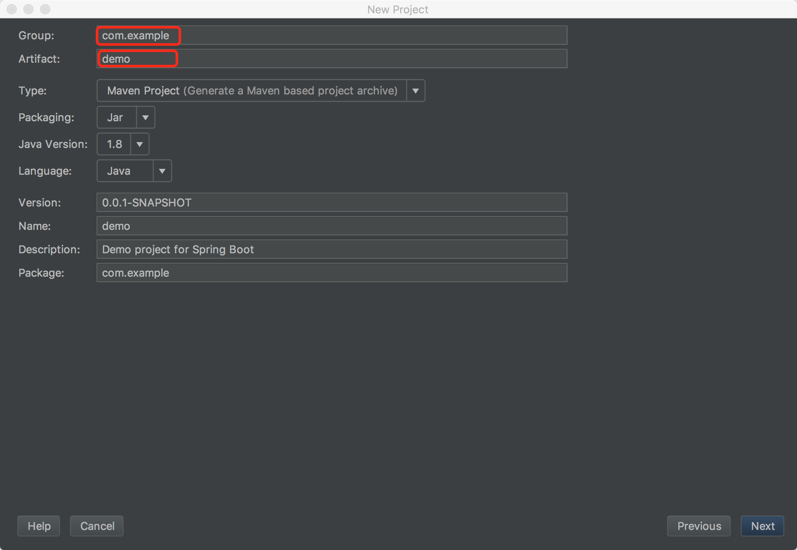
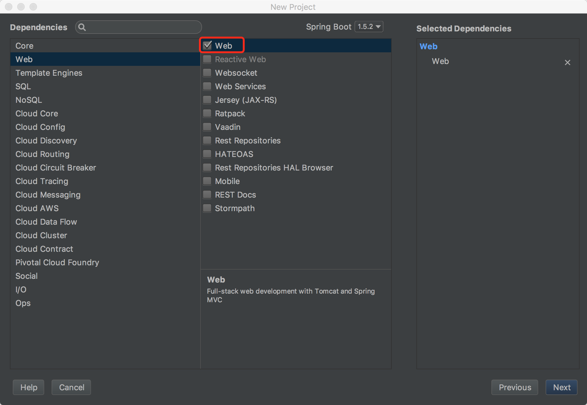
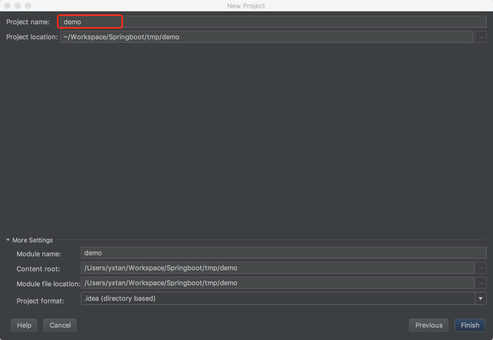
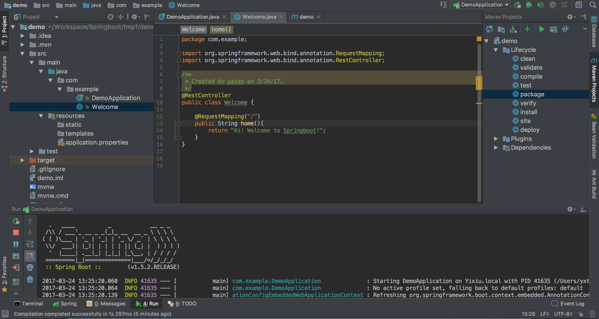
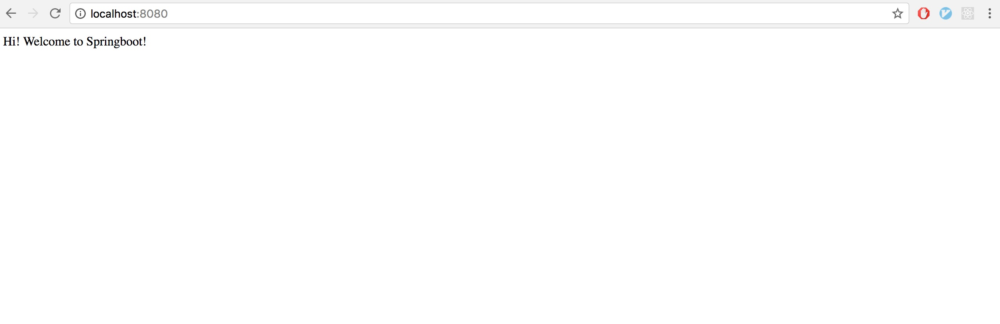

1. 点击 `Create New Project`，选择 `Spring Initializr`。
    

2. 点击 `Next`，然后填写相应的信息。
    

3. 点击 `Next`，然后选择对于的项目类型，我这里选择创建一个 web 项目。
    

4. 点击 `Next`，然后填写 `Project Name` 等信息。
    

5. 点击 `Finish`，就完成了。

6. 可以尝试创建一个类，运行，在浏览器输入 [http://localhost:8080](http://localhost:8080) 查看效果。
    
    
